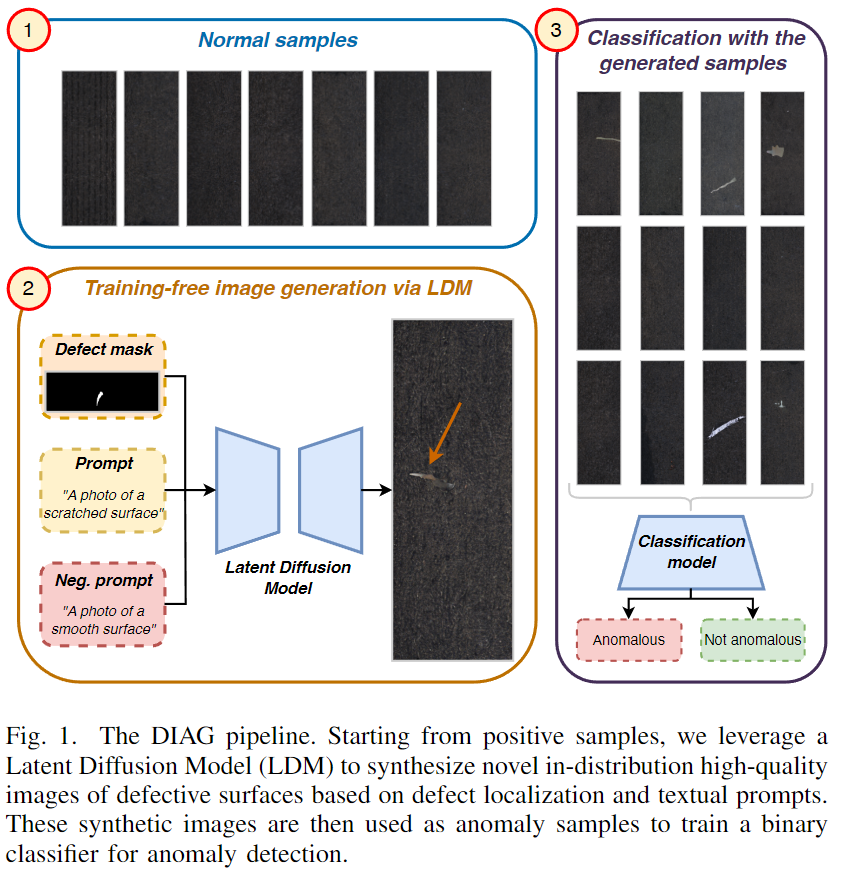

# Leveraging Latent Diffusion Models for Training-Free In-Distribution Data Augmentation for Surface Defect Detection #

Official code implementation for "Leveraging Latent Diffusion Models for Training-Free In-Distribution Data Augmentation for Surface Defect Detection" accepted @ CBMI24.
<p align="center">
  
</p>

## Installation ##

### Clone the repository ###

```bash
git clone https://github.com/intelligolabs/DIAG.git
cd DIAG
```

### Create environment with dependencies ###
Create a conda environment and install Pytorch. Note: this command installs PyTorch 1.12 with CUDA 11.3. Change it depending on your own version of CUDA.
```bash
conda create -n DIAG python=3.10
conda activate DIAG
pip install torch==1.12.1+cu113 torchvision==0.13.1+cu113 torchaudio==0.12.1 --extra-index-url https://download.pytorch.org/whl/cu113
```

Then install the requirements:
```bash
pip install -r requirements.txt
```

### Data preparation ###
Download KSDD2 from the [official KSDD2 website](https://www.vicos.si/resources/kolektorsdd2/).

Run the `ksdd2_preprocess.py` script. This will create a pre-processed copy of KSDD2 in the `--dst_dir`. We will use this pre-processed copy for our augmentation and evaluation.
```bash
python ksdd2_preprocess.py --src_dir="<path_to>/ksdd2" --dst_dir="<path_to>/ksdd2_preprocessed"
```

### [Optional] Set up wandb for logging ###
Optionally you can log the training and evaluation to wandb.
```
wandb init
```

## Data augmentation ##
This step generates the augmented positive images. The images are generated using the same prompts used in the original paper. The `src_dir` argument should point to the preprocess data root (see `Data preparation` step).

By default, this script will generate the augmented images in an `augmented_<img_per_prompt * prompts>` folder inside `src_dir`. This is needed for the dataloader during training.
```bash
python generate_augmented_images.py --src_dir="<path_to>/ksdd2_preprocessed" --imgs_per_prompt=50  --seed=0
```

## Training and evaluation ##
In this step, we will fine-tune a pre-trained ResNet-50 on the (augmented) KSDD2.
Different arguments handle the policy for training:
- `--zero_shot` trains the model without GT positive images
- `--add_augmented` adds the augmented images to the dataset (can be both zero or full shot)
- `--num_augented` selects how many augmented images to add to the training set. Required if using `--add_audmented`. Note that this MUST be the TOTAL (`imgs_per_prompt * prompts`) number of images generated in the previous step.

Example of DIAG training (zero shot with augmentations):
```bash
python train_ResNet50.py --seed=0 --epochs=30 --batch_size=32 --num_workers=8 --dataset_path="<path_to>/ksdd2_preprocessed" --zero_shot --add_augmented --num_augmented=100 --logging
```

## Credits ##
- Kolector Surface-Defect Dataset 2. More info [here](https://www.vicos.si/resources/kolektorsdd2/).
- [Diffusers](https://huggingface.co/docs/diffusers/en/using-diffusers/sdxl) and [StabilityAI](https://huggingface.co/diffusers/stable-diffusion-xl-1.0-inpainting-0.1) for their SDXL implementation and weights.

## Authors ##
Federico Girella, Ziyue Liu, Franco Fummi, Francesco Setti, Marco Cristani, Luigi Capogrosso

*Department of Engineering for Innovation Medicine, University of Verona, Italy*

`name.surname@univr.it`

## Citation ##
If you use [**DIAG**](https://arxiv.org/abs/2407.03961), please, cite the following paper:
```
@article{girella2024leveraging,
  title={Leveraging Latent Diffusion Models for Training-Free In-Distribution Data Augmentation for Surface Defect Detection},
  author={Girella, Federico and Liu, Ziyue and Fummi, Franco and Setti, Francesco and Cristani, Marco and Capogrosso, Luigi},
  journal={arXiv preprint arXiv:2407.03961},
  year={2024}
}
```
